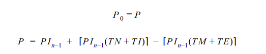
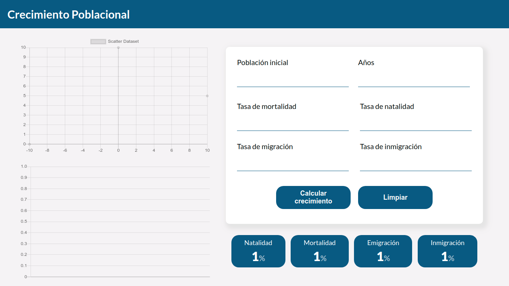
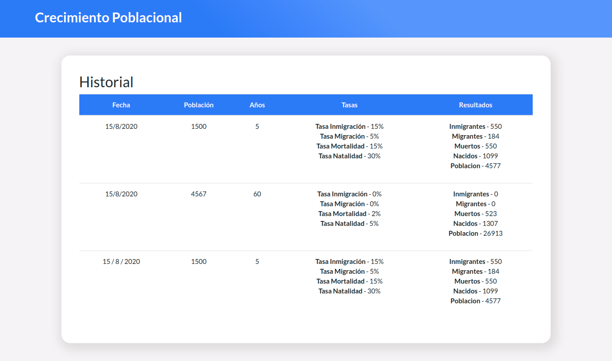

## Simulador de Crecimiento Poblacional

Un pequeño simulador para visualizar el crecimiento poblacional basado en los siguientes entradas: 
- Población inicial
- Tasa de natalidad
- Tasa de mortalidad
- Tasa de inmigración
- Tasa de emigración

La salida es producida por la siguiente fórmula: 

**Preview:**

**URL:** https://ts-crecimiento-poblacional.web.app/

**Imagenes:**

*****

## ¿Cómo usarlo?

1- Introduce los valores de:
  - Población inicial
  - Tasa de natalidad
  - Tasa de mortalidad
  - Tasa de inmigración
  - Tasa de emigración

2- Haz click el botón de **calcular crecimiento**.
   Este pasara los valores de las tasas a los indicadores inferiores. Mientras calcula los valores que se mostraran en las graficas. 

3- Las graficas se leen de la siguiente manera:
  - La gráfica superior indica el cambio de las personas en cada año según la natalidad, mortalidad, inmigración y migración. 
  - La gráfica inferior es el crecimiento total de la población al final de cada año. 

4- En la parte superior en el botón de **More+** se enlistan dos opciones: 
  - **Repositorio:** Un enlace a este repositorio.
  - **Historial**: Un enlace a una tabla que muestra el historial de cada simulación. 

  