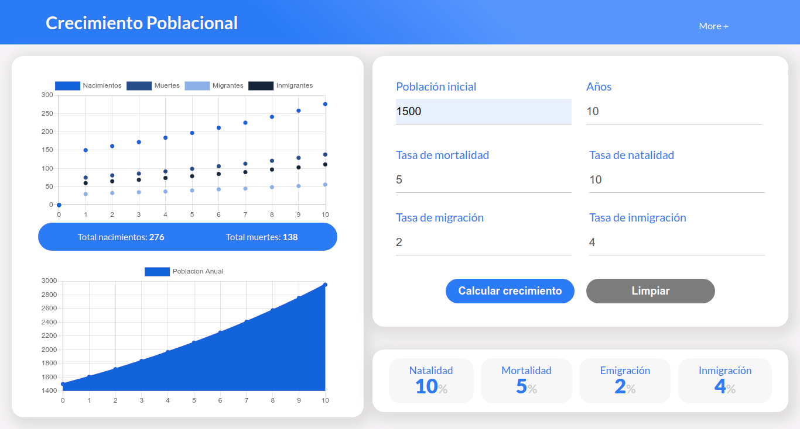

## Simulador de Crecimiento Poblacional

Un pequeño simulador para visualizar el crecimiento poblacional basado en los siguientes entradas: 
- Poblacion inicial
- Tasa de natalidad
- Tasa de mortalidad
- Tasa de inmigración
- Tasa de emigración

La salida es producida por la siguiente fórmula: 

**Preview:**

